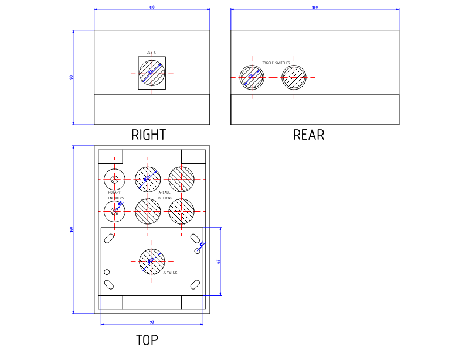
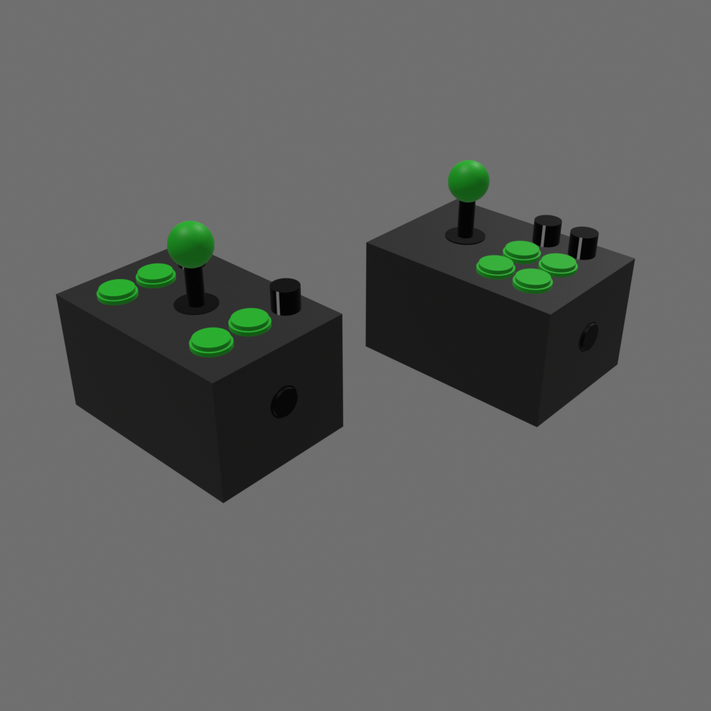
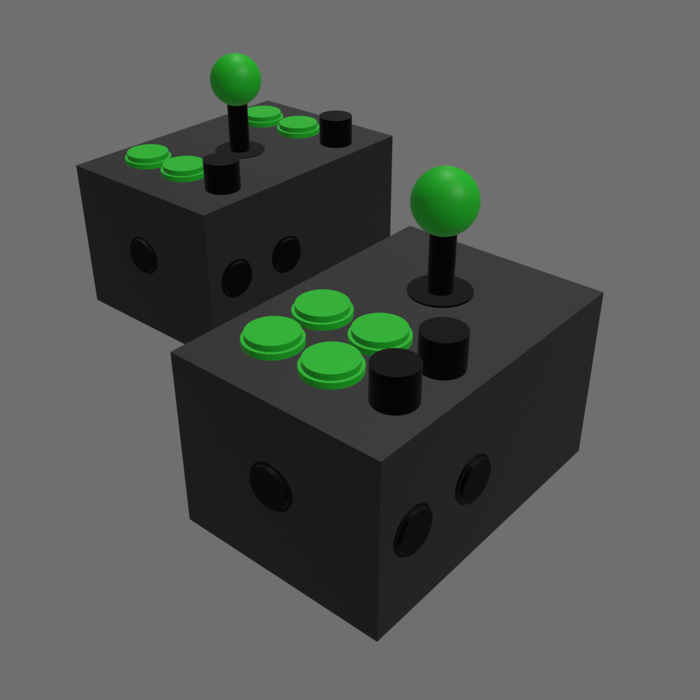

# QMK configuration for joystick input device.

This project implements the QMK firmware configuration for the "joyboard" custom input device.

## Overview

The joyboard consists of a joystick, two rotary encoders (with pushbuttons), four arcade buttons, and two 3-way rocker switches.

## Parts list

| Quantity | Item                                                               |
| -------- | ------------------------------------------------------------------ |
| 1        | [160mmx110mmx90mm project box](https://a.co/d/0czWrPIz)            |
| 2        | [Snap-in round momentary rocker switch](https://a.co/d/0cHW5Blm)   |
| 2        | [Aluminum knob](https://a.co/d/036jfmPl)
| 2        | [EC11 rotary encoder](https://a.co/d/08Swv7bY)                     |
| 4        | [24mm arcade buttons](https://a.co/d/00qQOsl5)                     |
| 1        | [Seimitsu LS-40 Joystick][joystick]                                |
| 1        | [Waveshare RP2040-Zero](https://www.waveshare.com/rp2040-zero.htm) |
| 1        | [D-type USB C panel mount](https://a.co/d/0aqtTgPk)                |

[joystick]: https://paradisearcadeshop.com/collections/seimitsu-ls-40-series/products/seimitsu-ls-40-01-se-joystick-black

## Pin assignments

```
                      ┌───┐
            5V ─── ┌──└───┘──┐ ─── GP0 BUTTON3
           GND ─── │   USB   │ ─── GP1 BUTTON2
            3V ─── │         │ ─── GP2 ENC0-A
BUTTON1   GP29 ─── │         │ ─── GP3 ENC0-B
BUTTON0   GP28 ─── │         │ ─── GP4 ENC0-Switch
TOGGLE1-A GP27 ─── │         │ ─── GP5 ENC1-A
TOGGLE1-B GP26 ─── │         │ ─── GP6 ENC1-B
TOGGLE0-A GP15 ─── │         │ ─── GP7 ENC1-Switch
TOGGLE0-B GP14 ─── └┬─┬─┬─┬─┬┘ ────GP8
                    │ │ │ │ │
                    │ │ │ │ │
                    G G G G G
                    P P P P P
                    1 1 1 1 9
                    3 2 1 0

           JOYSTICK - U D R L        
```

## Layout

You can find `.dxf` drawings of the Joyboard in the [panel/](panel/) directory.



## Rendered images

Front view:



Rear view:



## Firmware

To compile the firmware, run:

```sh
bash compile.sh
```

After placing the joyboard in BOOTSEL mode (entering bootsel mode), you can install new firmware by running:

```sh
bash install.sh
```

### Entering BOOTSEL mode

There are two ways to enter bootsel mode:

1. Hold down `BUTTON0` (upper left button) when plugging in the joyboard.

2. While the joyboard is powered on, press both encoders down at the same time.
