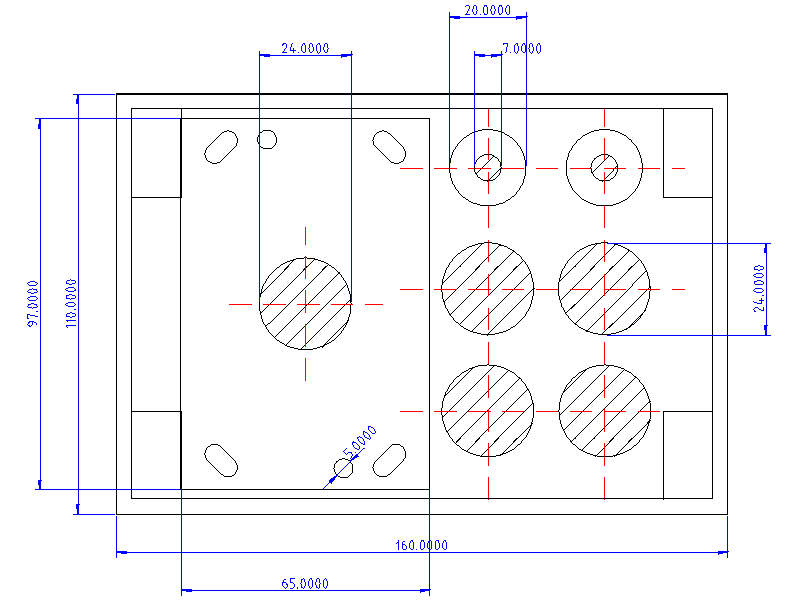
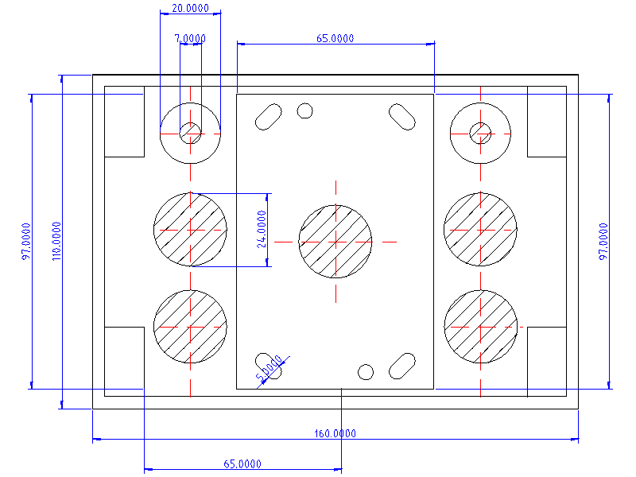
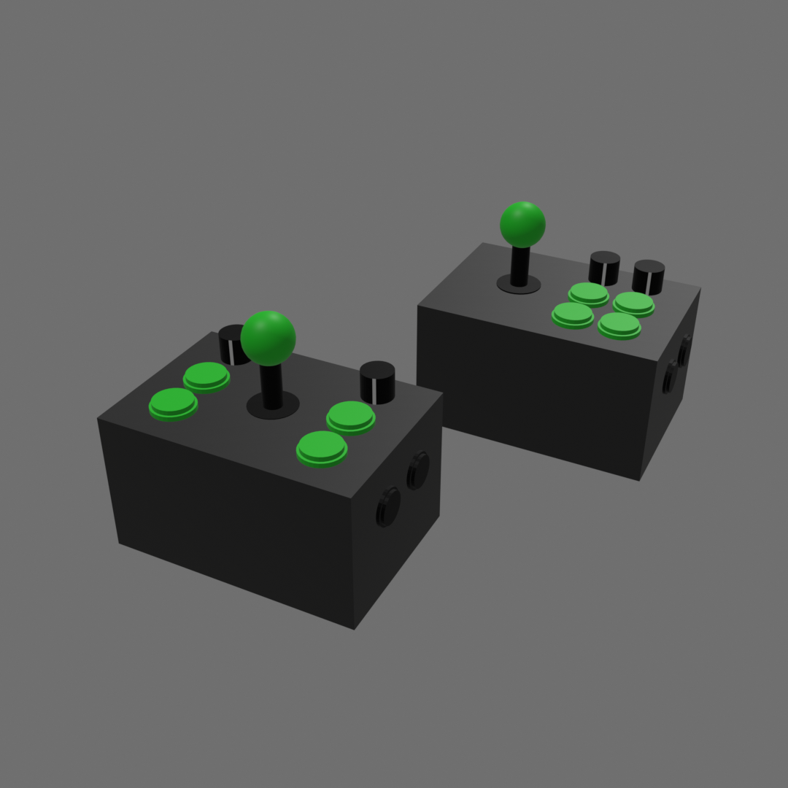

# QMK configuration for joystick input device.

This project implements the QMK firmware configuration for the "joyboard" custom input device.

## Overview

The joyboard consists of a joystick, two encoders (with pushbuttons), four arcade buttons, and two 3-way rocker switches.

## Parts list

| Item           | Detail                                                                                                                          |
| -------------- | ------------------------------------------------------------------------------------------------------------------------------- |
| Enclosure      | [Otdorpatio 160x110x90 mm project box](https://a.co/d/0czWrPIz)                                                                 |
| Rocker switch  | [mxuteuk snap-in round momentary rocker switch](https://a.co/d/0cHW5Blm)                                                        |
| Rotary encoder | [Taiss EC11 rotary encoder](https://a.co/d/08Swv7bY)                                                                            |
| Knobs          | [Tais 20mm black aluminum knob](https://a.co/d/0dfDT7EH)                                                                        |
| Arcade buttons | [EG STARTS 24mm arcade buttons](https://a.co/d/00qQOsl5)                                                                        |
| Joystick       | [Seimitsu LS-40](https://paradisearcadeshop.com/collections/seimitsu-ls-40-series/products/seimitsu-ls-40-01-se-joystick-black) |
| Controller     | [Waveshare RP2040-Zero](https://www.waveshare.com/rp2040-zero.htm)                                                              |

## Pin assignments

| GPIO | Connection  |
| ---- | ----------- |
| 10   | JOY RIGHT   |
| 9    | JOY LEFT    |
| 12   | JOY UP      |
| 11   | JOY DOWN    |
| 0    | BUTTON1     |
| 1    | BUTTON0     |
| 28   | BUTTON2     |
| 29   | BUTTON3     |
| 7    | ENC0-Switch |
| 5    | ENC0-A      |
| 6    | ENC0-B      |
| 4    | ENC1-Switch |
| 2    | ENC1-A      |
| 3    | ENC1-B      |
| 27   | TOGGLE0-A   |
| 26   | TOGGLE0-B   |
| 15   | TOGGLE1-A   |
| 14   | TOGGLE1-B   |

## Layouts

### Joystick on the side

### Joystick centered

## Rendered images

